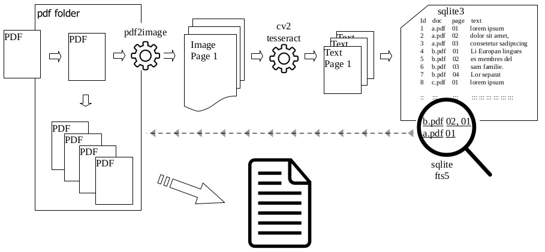

Sqlite full text search in multiple pdfs

Make a full-text search in multiple PDF, using a Sqlite database on a linux system. In principle, the code can also be used for windows or mac. In these cases, the necessary software packages correspond to the respective operating systems.

All new pdf files in a folder are indexed. For this all pdf are read in page by page as images. These images are converted to text using [tesseract](https://github.com/tesseract-ocr/tesseract) resp. [pytesseract](https://pypi.org/project/pytesseract/) an OCR (optical character recognition) and the text is populated into the database. The indirect procedure via OCR is made in order to be able to also read in pdf files that contain text in image form.

The next part of the application is a search. For that purpose, the database is searched by using FTS for keywords that have been processed in advance. Results are displayed as a link to the document and also to the found pages.

## How it works





## Preparations

The following preparations are necessary for the setup on a linux/debian system.

Install software packages via ```sudo apt install SOFTWARE-PACKAGE```:

```shell
poppler-utils
tesseract-ocr-deu
tesseract-ocr-eng
tesseract-ocr-fra
tesseract-ocr-osd
tesseract-ocr
```

I have listed the language packs for German, French and English, because I deal a lot with European documents and they are primarily published in these languages. If you need other language packs, you have to install them as well. You can find an overview of the language packages here [Tesseract documentation - Languages supported](https://tesseract-ocr.github.io/tessdoc/Data-Files-in-different-versions.html).  

Following python libraries are necessary. Install them via ```pip install PYTHON-LIBRARY```

```shell
numpy==1.19.2
opencv-python==4.5.4.60
pandas==1.1.3
pdf2image==1.16.0
pytesseract==0.3.8
```

sqlite3 is part of the python standard library and therefore does not need to be installed separately.


## How to use

When the package has been successfully installed and configured (1), PDFs can be stored in the automatically created *pdf_files* folder. All new PDFs in the folder are recognised and their texts are read out using OCR and then the database is populated (2). The full text search can be run across all previously recorded PDFs (3). Default settings can be changed in the file *pdf_fts.conf*, e.g. the number of languages to be recognised.  


### 1. Setup database and folder structure

*pdf_fts_setup.py*


```python
from database.setup import NewDataBase
from filemanager.setup import Folders

F = Folders()
F._setup_pdf()
F._setup_img()

NDB = NewDataBase()
NDB.create()
```

```shell
folder /home/path_to_project_folder/pdf_folder will be created
folder /home/path_to_project_folder/temp will be created
create folder for database: /home/path_to_project_folder/fts_sqlite
```

Start the setup script in order to initialise a sqlite database and two folders. One folder for the *pdf_files* and a second folder *tmp* for temporary store image files of the PDFs. Database and folders can also be created manually. In this case, some modifications in the *pdf_fts.conf* file are necessary. 
By default the following folder structure is used:

```shell
.
├── pdf_fts_setup.py
├── pdf_fts_populate.py
├── pdf_fts_search.py
├── pdf_fts.conf
├── sqlite
│   └── fts_database
├── convert
│   ├── __init__.py
│   ├── ocr.py
│   └── pdf.py
├── database
│   ├── __init__.py
│   ├── populate.py
│   ├── query.py
│   └── setup.py
├── filemanager
│   ├── __init__.py
│   ├── remove.py
│   ├── setup.py
│   └── status.py
├── pdf_files
│   ├── abc.pdf
│   ├── xyz.pdf
│   ├── 123.pdf
│   └── ... .pdf
└── tmp
```


### 2. Populate database

In order to populate the database with the texts of the PDFs, the corresponding PDFs must be stored in the *pdf_files* folder (e.g. by drag and drop). If new PDFs (not yet captured) are in this folder and the script *OCR* is started, the files are processed for the full-text search and saved in the database. The PDFs must remain in the folder because the search results link to these documents.

*pdf_fts_populate.py*


```python
from database.query import RegisteredPDF
from database.populate import InsertData
from filemanager.status import CheckPDF, CheckImages
from filemanager.remove import TempImages
from convert.pdf import ConvertPDF
from convert.ocr import OCR

DB_PDF = RegisteredPDF()
ID = InsertData()
CPDF = CheckPDF()

CPDF.pdf_registered = DB_PDF.query()
CPDF.status_pdf()
TEMP = TempImages()
TEMP._delete()

for file in CPDF.pdf_new:
    CONV = ConvertPDF()
    CONV.picturise(file)
    
    text_all_pages = OCR().get_text(CONV.new_converted_pdf)
    ID.populate([tuple(doc) for doc in text_all_pages])
    print('ready')

    TEMP._delete()
```

```shell
check pdf files in /home/path_to_project_folder/pdf_files
... 2 new pdf files found.
remove all temporary image files from folder /home/path_to_project_folder//tmp
start ocr from 38 pages
......................................ready
remove all temporary image files from folder /home/path_to_project_folder/tmp ...
```

Converting the PDFs into text can take a while. How long it takes per PDF page depends on how many languages are to be considered in the text recognition in parallel, how many CPUs are available and how good the quality of the PDFs is. On a test system with 8 CPUs, text recognition for one language takes about 1 second per A4 PDF page with text and diagrams . Text recognition for three languages in parallel takes about one hour for 2500 A4 PDF pages. If individual documents are newly included in the search, the process is relatively quick. However, if many documents are added at once, this can take a correspondingly long time until they are all recorded in the database. But the effort is worth it, as the subsequent search takes only milliseconds.

### 3. Full-text search

By entering the search words in the script *pdf_fts_search.py*, a full-text search is executed. The results are listed as links to the respective PDFs and to the pages of the search results. [further information on sqlite.org/fts5.html](https://www.sqlite.org/fts5.html)

*pdf_fts_search.py*


```python
from database.query import FullTextSearch
FTS = FullTextSearch()

search_term = input('search term: ')
FTS.query(search_term)
```

```python
search term: photovoltaic AND "lithium ion battery"
```
searching results for photovoltaic* AND "lithium ion battery"


|      |                                            found in document |                                               found on pages |
| ---: | -----------------------------------------------------------: | -----------------------------------------------------------: |
|    0 | [IEC_61427-2_BS_EN_61427-2ED1.0_2012-11_ENGLISCH.pdf] | [doc]|
|    1 | [/Transport of dangerous goods 2022_Vol2_WEB_0.pdf] | [108] [124] [123] [280] |
|    2 |      [/VDE_0520-933-5-2.pdf] |                        [doc] |
|    3 | [/IEC_61427-2_CD_IEC_61427_2_Secondary_Batteries_PV_ongrid_application 373_2012-0186_6_CD_2012_11_DEUTSCH.pdf] | [doc] |
